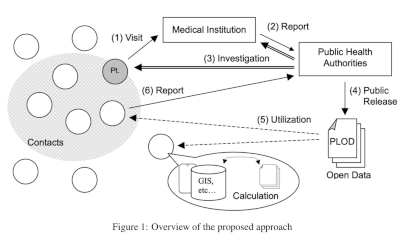

penguin, a PLOD server
======================

PLOD is short for Patient Locational Open Data.
This software has the following features.

- providing a simple entry form so that an operator can input PLOD.
- storing PLOD into No-SQL database through REST API.
- providing PLODs through REST API.

Hence, this software can help #4, #5, and a part of #3 in the picture that depicts the overview of the approach.



Please visit the [plod.info](http://plod.info) and see the following paper if you want to know the detail about PLOD.

- [Tracing patients' PLOD with mobile phones: Mitigation of epidemic risks through patients' locational open data](https://arxiv.org/abs/2003.06199)

## Data model

e.g.

```
{
    "publisher": "厚労省",
    "localId": "13",
    "localSubId": "1",
    "disease": "COVID-2019",
    "dateConfirmed": "1999-01-31",
    "age": "20s",
    "gender": "Female",
    "residence": "千葉県",
    "locationHistory": [
        {
            "departureDate": "2020-01-16",
            "departureTime": "12:00:00",
            "departureFrom": "東京都",
            "departureFromAnnex": "東京都",
            "arrivalDate": "2020-01-16",
            "arrivalTime": "15:00:00",
            "arrivalIn": "大阪府",
            "arrivalInAnnex": "大阪府",
            "vehicles": [
                "Taxi",
                "Bus",
                "Train",
                "Airplane",
                "Ship",
                "Walk"
            ],
            "vehicleOthers": "",
            "details": ""
        }
    ],
    "conditionHistory": [
        {
            "reportDate": "2020-01-16",
            "reportTime": "",
            "conditions": [
                "cndMalaise",
                "cndSputum",
                "cndFever",
                "cndChill",
                "cndCough",
                "cndPneumonia",
                "cndHospitalized",
                "cndPositive"
            ],
            "conditionOthers": "",
            "details": ""
        }
    ]
}
```

## Interfaces

- GET /crest

provides a PLOD feeder for your input.

- POST /beak

receives a PLOD in JSON format.
And, put it into the database.

An example by using curl command:
```
% curl -X POST -d@data.json -k https://plod.server/beak
{"msg_type": "response", "status": 200, "ts": "2020-03-29T09:23:20.560907", "result": {"event_id": "0731f36c-51fb-41f7-b808-f63d125548a3"}}
```

- GET /tummy

It provides PLODs in JSON or Turtle, matched the condition specified.
see also POST /tummy, which is another way to retrive PLODs.

    + GET /tummy/json/CONDITION
    + GET /tummy/turtle/CONDITION

CONDITION examples:

    + "all"
        * e.g. GET /tummy/json/all
    + reportId
        * GET /tummy/json/1ef3c491-a892-4410-b4db-dc755c656cd1
    + _id
        * GET /tummy/json/5e7d9ace0810c91d43c60130

A full example by using curl command:
```
% curl -k https://plod.server/tummy/json/5e8046d40810c97060607ebe
{"msg_type": "response", "status": 200, "ts": "2020-03-29T16:04:47.326933", "result": [{"publisher": "千葉県", "localId": "13", "localSubId": "1", "disease": "COVID-2019", "dateConfirmed": "2020-01-31", "age": "20s", "gender": "Female", "residence": "千葉県", "locationHistory": [{"departureDate": "2020-01-16", "departureFrom": "東京都", "arrivalDate": "2020-01-16", "arrivalIn": "大阪府", "byTrain": true}, {"departureDate": "2020-01-22", "departureFrom": "大阪府", "arrivalDate": "2020-01-22", "arrivalIn": "東京都", "byTrain": true}], "cndHistory": [{"reportDate": "2020-01-16", "cndMalaise": true}, {"reportDate": "2020-01-22", "cndChill": true}], "reportId": "96cb3e7f-63c4-4293-affb-6a7b46432a96", "_id": "5e8046d40810c97060607ebe"}]}
```

- POST /tummy

Provides PLODs matched the condition specified.
Pleas see also GET /tummy.

    + POST /tummy/json/CONDITION
    + POST /tummy/turtle/CONDITION

You can set a query for MongoDB into the HTML body.

An example by using curl command:
```
% curl -k -X POST -H'content-type: application/json; charset=utf-8' -d '{ "locationHistory": {"$elemMatch": { "departureFrom": "東京都" }}}' https://plod.server/tummy/json
```

## Requirements

- Charactor encoding
    + UTF-8

- User-side
    + Chrome
        * Mac: Version 80.0.3987.149
        * Windows10:
    + Firefox
        * Mac: 72.0.2
        * Windows10:
        * Windows7:

- Python3
    + python 3.7.2.  may not work on other version.
    + pymongo
    + (plan)Tornado

- MongoDB

## Acknowledgements

- Thanks to a Ms./Mr. unknown author for providing a funcy logo of PLOD penguin !

## Links to the useful tools

- [Japan local goverment list](https://www.soumu.go.jp/denshijiti/code.html)
- RDF to JSON-LD [ttl2jsonld](https://frogcat.github.io/ttl2jsonld/demo/a)
- JSON-LD to any [jsonld.js](https://github.com/digitalbazaar/jsonld.js)
- [graph viewer](https://www.kanzaki.com/works/2009/pub/graph-draw).
- Many information and tools about RFD at (https://www.kanzaki.com/docs/sw/)

