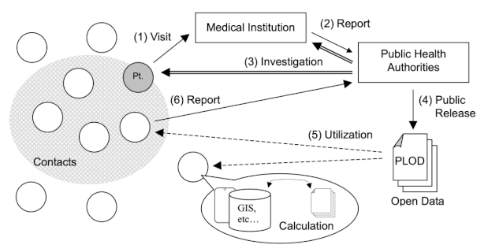
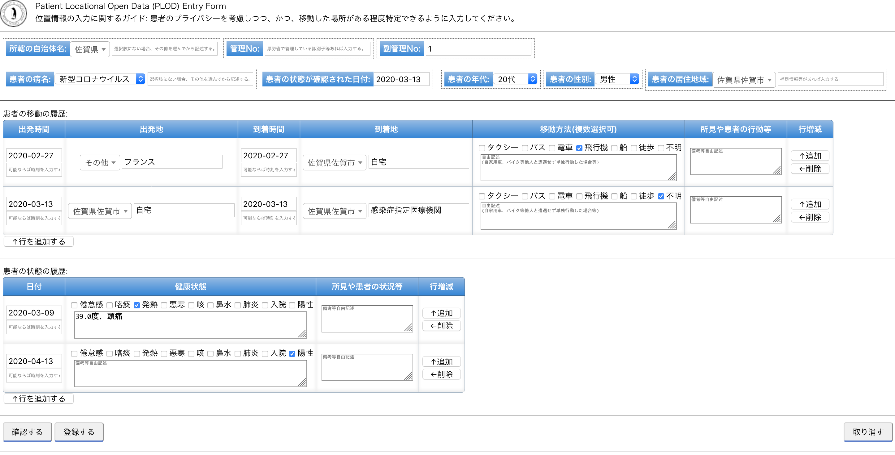

penguin, a PLOD server
======================

This is an implementation of Patient Locational Open Data (PLOD) service.

Please visit the https://www.plod.info/ and see the following paper if you want to know the detail about PLOD.

- [Tracing patients' PLOD with mobile phones: Mitigation of epidemic risks through patients' locational open data](https://arxiv.org/abs/2003.06199)

This software has the following features.

- providing a simple entry form so that an operator can input PLOD.
- storing PLOD into No-SQL database through REST API.
- providing PLODs through REST API.

Hence, this software can help a part of #3, #4, and #5 in the picture that depicts the overview of the approach.

Here is the overview of the software architecture and use case.

You can refer to the [implementation note](IMPLEMENTATION.md) about Data model, API, and others.

## Screenshot

- view of the entry form for PLD.

- view of the PLOD list.

- view of the detail of a PLOD.

## Docker compose

Docker is available.  See and try below.

- https://github.com/tanupoo/penguin-docker

## Requirements

- Charactor encoding
    + UTF-8

- User-side
    + Chrome
        * Mac: Version 80.0.3987.149
        * Windows10:
    + Firefox
        * Mac: 72.0.2
        * Windows10:
        * Windows7:

- Python3
    + python 3.7.2.  may not work on other version.
    + pymongo
    + (plan)Tornado

- MongoDB

## Acknowledgements

- Thanks to a.ym (@yachts111xenon) for providing a funcy logo of the PLOD penguin !
