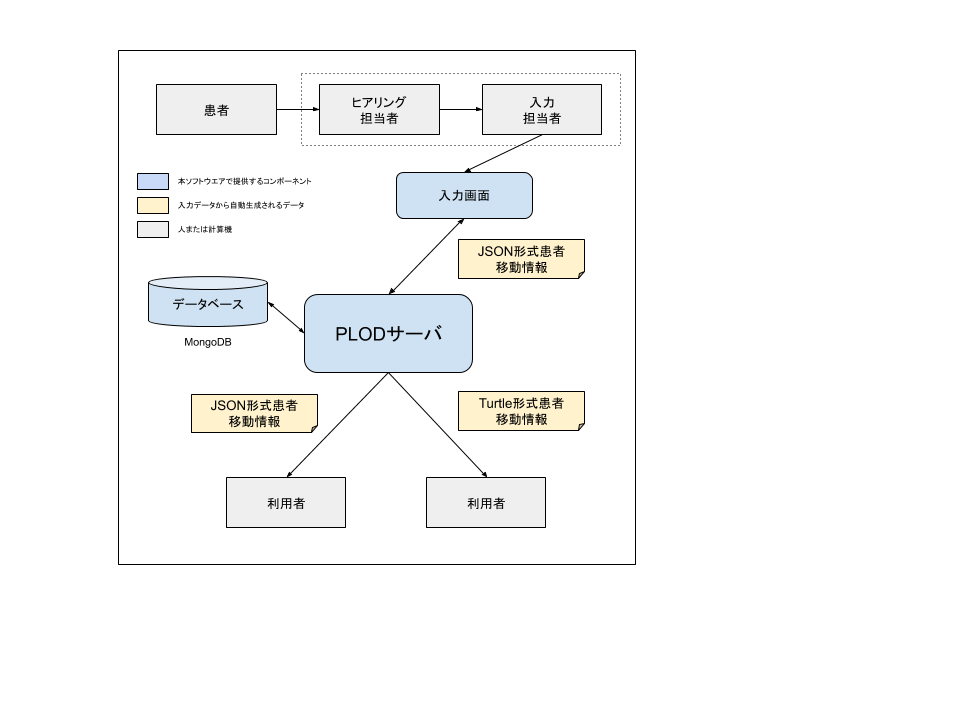

penguin, a PLOD server
======================

a Patient Locational Open Data (PLOD) server.
Please see [README](README.en.md) in English.

PLOD については https://www.plod.info/ と下記論文を参照のこと。

- [Tracing patients' PLOD with mobile phones: Mitigation of epidemic risks through patients' locational open data](https://arxiv.org/abs/2003.06199)

このソフトウエアは、
上記論文で提案されたアプローチを示す図の#3, #4, #5 の作業をサポートするために、
3つの機能を持つ。

- PLOD を入力する簡単なフォームを提供する。
- REST API から入力された PLOD を、No-SQL データベースに蓄積する。
- 指定された PLOD を REST API を使って JSON形式あるいは Turtle形式で提供する。

このソフトウエアのアーキテクチャと利用形態の概要を下図に示す。

データモデルとAPIなどは [IMPLEMENTATION NOTE](IMPLEMENTATION.md) を参照のこと。

## Screenshot

- PLODの入力フォームの例

- PLODリストの例

- PLODリストから指定したPLODの詳細を表示した例

## Docker compose

docker compose が使える環境であれば、
下記を使って簡単に導入することができる。

- https://github.com/tanupoo/penguin-docker

## 動作要件

- Charactor encoding
    + UTF-8
- User-side
    + Chrome
        * Mac: Version 80.0.3987.149
        * Windows10:
    + Firefox
        * Mac: 72.0.2
        * Windows10:
        * Windows7:
- Python3
    + python 3.7.2.  may not work on other version.
    + pymongo
    + (plan)Tornado
- MongoDB

## 謝辞

- Thanks to a.ym (@yachts111xenon) for providing a funcy logo of the PLOD penguin !

